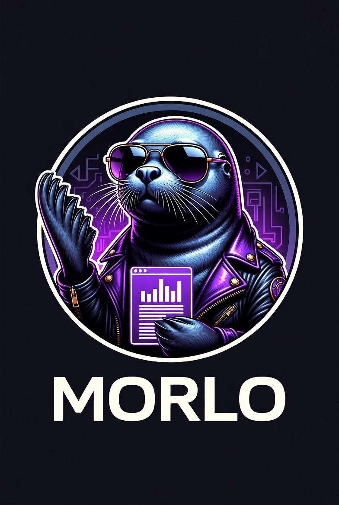

FOCA never died. It just needed a rewrite. Morlo hunts metadata, connects the dots and tells you what the target forgot to hide. Cross-platform OSINT document intelligence — extracts, correlates and scores. Replaces FOCA with a native Lazarus/FPC binary — no .NET, no Python, no excuses.


<p align="center">
  
</p>

<h3 align="center">FOCA never died. It just needed a rewrite.</h3>

<p align="center">
  <strong>Morlo</strong> hunts metadata, connects the dots and tells you what the target forgot to hide.<br>
  Cross-platform OSINT document intelligence — extracts, correlates and scores.<br>
  Replaces FOCA with a native <strong>Lazarus/FPC</strong> binary — no .NET, no Python, no excuses.
</p>

<p align="center">
  
  
  
  
</p>

---

## What is this?

FOCA (Fingerprinting Organizations with Collected Archives) was a solid idea with a sad ending: Windows-only, abandoned by Telefónica/ElevenPaths in 2021, APIs rotting, issues unanswered since 2023.

**Morlo is not a clone. It is a hate-fueled rewrite.**

A native, portable, open-source OSINT platform for document intelligence. It digs into metadata, finds what the target left behind, correlates the evidence, and scores the risk — all from a single binary that fits on a USB stick.

### What it does
- **Hunts** documents across the web (dorks, CommonCrawl, Wayback, GitHub, passive DNS)
- **Extracts** deep metadata from Office, PDF, images, emails, ZIPs, and more
- **Correlates** documents by author, software, printer, GPS, network traces
- **Scores** risk with CVE matching, breach checks, and normative mapping (ENS / ISO 27001 / NIS2 / DORA)
- **Reports** in self-contained HTML with interactive correlation graphs

### What it does NOT do
- Run on .NET, Python, Java, or any runtime heavier than a text editor
- Phone home, send telemetry, or talk to servers you didn't ask it to
- Pretend to be a full OSINT suite (it's document intelligence, not people stalking)
- Work on magic (it's compiled Pascal, not a LLM)

---

## Stack

| Layer | Tech | Why |
|-------|------|-----|
| Core engine | **Free Pascal / Lazarus** | Native binary. Zero runtime dependencies. Cross-compile to Linux/Windows/macOS. |
| HTTP / TLS / SOCKS5 | `fphttpclient` (RTL) | No external libs. Built-in. |
| ZIP / OOXML / ODF | `zipper` + `xmlread` (RTL) | Native. No Java, no Python, no 7z CLI required for basic ops. |
| JSON | `fpjson` (RTL) | Native. |
| SQLite + FTS5 | `sqlite3` wrapper | Embedded, serverless, full-text search. |
| Subprocess wrappers | `TProcess` | Optional glue for `exiftool`, `theHarvester`, `amass`, `deda`. |
| GUI | Lazarus LCL (GTK/Win32/Cocoa) | Native widgets. No Electron, no Qt bloat. |
| Graph viz | Vis.js in `TWebBrowser` | FPC generates JSON, WebKit renders it. Clean separation. |

---

## 🎅 Dear Santa — The Christmas List

> **What this is:** The *"Carta a los Reyes Magos"* — that thing Spanish kids do every January.  
> They ask for *everything*, not knowing if they need it, just because it's on TV.  
> That's exactly how clients write software requirements.  
> This is our version. We know what we want. We just don't have infinite elves.

### Shipped | WIP | Backlog | Probably Never

| # | Item | Status | Phase |
|---|------|--------|-------|
| 1 | Native HTTP dorking (Google/Bing/DDG) via `fphttpclient` | 🚧 | 1 |
| 2 | SQLite backbone + FTS5 search | 🚧 | 1 |
| 3 | EXIF / OOXML / PDF metadata via native FPC + `exiftool` fallback | 🚧 | 1 |
| 4 | Stealth layer: UA rotation + token bucket + jitter | 📝 | 1 |
| 5 | EML/MIME parser (Received chain, X-Mailer, X-Originating-IP) | 📝 | 2 |
| 6 | ZIP/RAR/7z recursive extraction + inner metadata | 📝 | 2 |
| 7 | PDF native parser (XMP / Info dict) — no `libpoppler` | 📝 | 2 |
| 8 | OLE2/CFBF native parser (.doc, .xls, .msg) | 📝 | 2 |
| 9 | Correlation engine: fuzzy authors, software hash, GPS DBSCAN | 📝 | 3 |
| 10 | PrinterWatermarks / MIC detection (DEDA wrapper) | 📝 | 3 |
| 11 | DNS enum: brute force + crt.sh + AXFR | 📝 | 3 |
| 12 | CommonCrawl WARC parsing | 📝 | 3 |
| 13 | Wayback CDX API advanced filters | 📝 | 3 |
| 14 | GitHub Search API (code, commits, issues, gists) | 📝 | 3 |
| 15 | HIBP breach check (no key, 1 req/1.5s) | 📝 | 4 |
| 16 | NVD/OSV CVE scoring (software version → CVSS) | 📝 | 4 |
| 17 | Censys + Fullhunt.io attack surface (free tier) | 📝 | 4 |
| 18 | Risk score 0-10 + normative mapping (ENS / ISO 27001 / NIS2 / DORA) | 📝 | 5 |
| 19 | Self-contained HTML report with embedded graph | 📝 | 5 |
| 20 | Vis.js correlation graph in LCL WebView | 📝 | 6 |
| 21 | Native LCL GUI (GTK/Win32/Cocoa) | 📝 | 6 |
| 22 | Headless CLI mode for pipelines | 📝 | 1 |
| 23 | Active sources flag: OWA / Confluence / SharePoint fingerprinting | 🔮 | 7 |
| 24 | Tor / SOCKS5 / DoH integration | 🔮 | 7 |
| 25 | Burp Suite extension | 🔮 | 9 |
| 26 | Metasploit auxiliary module | 🔮 | 9 |

### Brain Dump (unsorted, raw, unfiltered)

```text
- Track Changes detection in DOCX (w:ins/w:del) — forensic gold
- Embedded files inside PDFs — hidden attachments with their own metadata
- SQLite .db schema extraction from leaked mobile apps
- SVG metadata (Inkscape/Illustrator fingerprints)
- CAD files (.dwg) — author, company, coordinates (industrial niche)
- RAW image EXIF (.cr2, .nef) — drone/camera forensics
- JavaScript inside PDFs — was it weaponized?
- Template fingerprinting across documents = same department
- Organizational chart inference from author/reviewer/approver chains
- Temporal delta analysis: who appeared, who disappeared, what upgraded
- LinkedIn dork generator (API is dead, dorks are forever)
- Hunter.io email verification (25/mo free — meh)
- PublicWWW source-code search
- Pastebin/Ghostbin leak scraping (noisy as hell)
- Google Drive / Dropbox public link dorks (legally grey)
- IPv6 AAAA enumeration (growing, but boring)
- Proxy rotation with residential/mobile pools (costs real money)
- Auto-update of dorks, UAs, wordlists from GitHub releases
- Plugin system for format parsers (.so / .dll hotload)
- FPCUnit test suite (we should, we won't, we know)
- CI/CD multiplatform builds (GitHub Actions + FPC cross-compile)
- AppImage / NSIS / DMG packaging (for the non-technical auditors)
- GPG-signed binaries (trust, but verify)
```

### Why This Exists

FOCA died because it was a corporate side-project with no revenue stream.  
Morlo lives because it's a **hate-fueled rewrite** with a clear target:  
**native binary, zero runtime bullshit, maximum forensic intelligence.**

We don't need 50 features. We need the *right* 10, done properly, in a single executable that fits on a USB stick.

Everything else is just noise until Phase 1 ships.

---

## License

GPL v3 — see [LICENSE](LICENSE) file.

Built with spite and Free Pascal in Galicia, Spain.

---

*Last updated: 2026-06-19*  
*Status: Santa hasn't confirmed the delivery date.*
